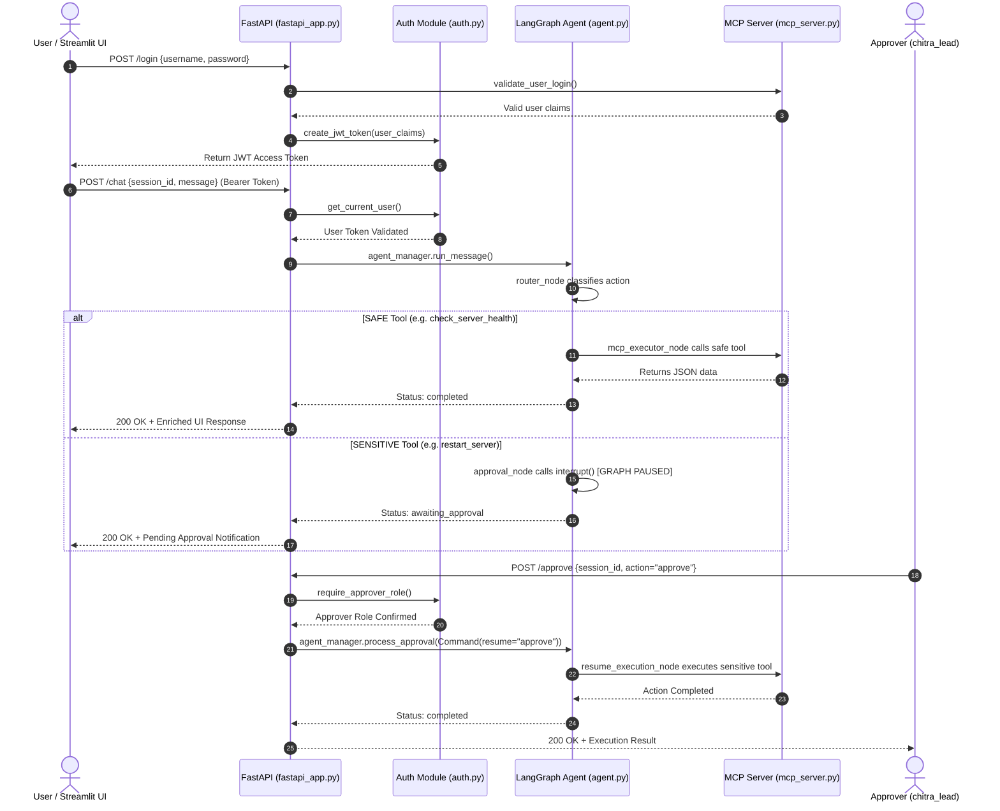

# 🏛️ Agentic AI & MCP System Architecture Documentation

This document provides a clean, structured reference of all endpoints, components, MCP tools, and LangGraph nodes across the codebase.

![End-to-End Visual System Architecture] (documents/end_to_end_system_architecture.png)

---

## 🔒 1. Authentication & Security Module (`auth.py`)

| Component / Function | Type | Description |
| :--- | :--- | :--- |
| `LoginRequest` | **Pydantic Model** | Validates incoming login payload (`username`, `password`). |
| `LoginResponse` | **Pydantic Model** | Defines response schema with `access_token`, `token_type`, `username`, `full_name`, and `role`. |
| `create_jwt_token()` | **Security Function** | Generates a signed HS256 JWT access token with 1-hour expiration and user role claims. |
| `get_current_user()` | **FastAPI Dependency** | Validates `HTTPBearer` token; returns user claims (`sub`, `role`) or raises `401 Unauthorized`. |
| `require_approver_role()` | **RBAC Guard** | Enforces role-based authorization; raises `403 Forbidden` if user is not an `approver`. |

---

## ⚡ 2. FastAPI REST Gateway (`fastapi_app.py`)

| Endpoint | HTTP Method | Access Level | Description |
| :--- | :--- | :--- | :--- |
| `/login` | **POST** | `Public` | Authenticates user credentials via MCP tool and issues a signed JWT token. |
| `/chat` | **POST** | `JWT Protected` | Submits user messages to `agent_manager.run_message()` for state execution. |
| `/approve` | **POST** | `JWT + Approver` | Approves or rejects pending sensitive actions via `agent_manager.process_approval()`. |
| `/pending_approvals` | **GET** | `JWT Protected` | Lists all global pending approvals awaiting human authorization across active sessions. |
| `/user_workflow_history` | **GET** | `JWT + Approver` | Provides workflow telemetry and graph execution node paths for all active sessions. |
| `/status/{session_id}` | **GET** | `JWT Protected` | Retrieves session conversation snapshot, pending payload, and execution trajectory. |
| `/health` | **GET** | `Public` | Returns FastAPI service health status (`{"status": "healthy"}`). |

---

## 🔌 3. Model Context Protocol Tools (`mcp_service/mcp_server.py`)

| MCP Tool Name | Security Level | Data Target | Description |
| :--- | :--- | :--- | :--- |
| `check_server_health` | 🟢 **SAFE (Auto)** | `data/servers.json` | Queries CPU, memory, disk percentage, and uptime metrics for a target server. |
| `get_ticket_status` | 🟢 **SAFE (Auto)** | `data/tickets.json` | Retrieves employee IT support ticket status, subject, and assignment details. |
| `calculate_refund` | 🟢 **SAFE (Auto)** | `data/orders.json` | Checks order amount and return policy window to verify refund eligibility. |
| `validate_user_login` | 🟢 **SAFE (Auto)** | `data/users.json` | Authenticates user credentials and returns full name and role claims. |
| `restart_server` | 🔒 **SENSITIVE (HITL)** | `data/servers.json` | Restarts a target server and updates last restart timestamp upon human approval. |
| `process_refund` | 🔒 **SENSITIVE (HITL)** | `data/orders.json` | Processes refund payment and sets `refund_eligible: false` upon human approval. |
| `escalate_ticket` | 🔒 **SENSITIVE (HITL)** | `data/tickets.json` | Escalates support ticket priority to `critical` and assigns to `IT-L3` upon human approval. |

---

## 🤖 4. LangGraph Agent State Machine (`agent.py`)

| Component / Node | Type | Category | Description |
| :--- | :--- | :--- | :--- |
| `AgentState` | **TypedDict** | **State Schema** | Preserves session state (`messages`, `session_id`, `status`, `pending_approval`, `node_history`). |
| `router_node` | **Graph Node** | **Entry Router** | Evaluates user query intent using LLM/fallback parser; routes to Safe vs Sensitive branch. |
| `mcp_executor_node` | **Graph Node** | **Execution** | Executes Safe read-only MCP tools and returns formatted JSON output cards. |
| `approval_node` | **Graph Node** | **HITL Interrupt** | Pauses graph execution natively via `interrupt()`; awaits `/approve` resumption signal. |
| `resume_execution_node` | **Graph Node** | **Execution** | Executes Sensitive MCP actions upon receiving human approval signal (`approve`). |
| `rejection_node` | **Graph Node** | **Termination** | Handles cancelled sensitive actions gracefully when human sends rejection signal (`reject`). |
| `fallback_heuristic_parser` | **Function** | **Parser** | Regex-based entity extractor ensuring 100% intent extraction even if LLM is offline. |
| `LangGraphAgentManager` | **Class** | **Orchestrator** | Thread-safe session manager connecting FastAPI endpoints to LangGraph state machine. |

---

## 🌐 5. End-to-End Sequence Flow

